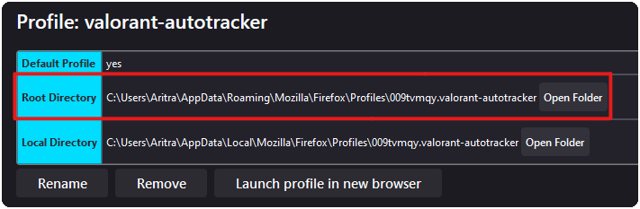
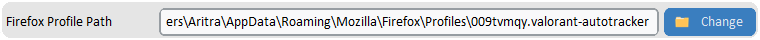
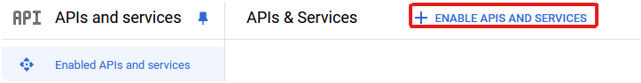
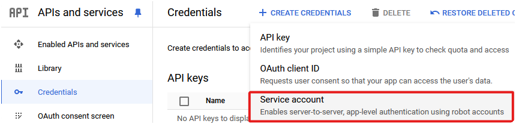
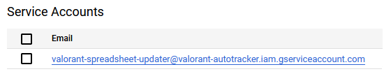
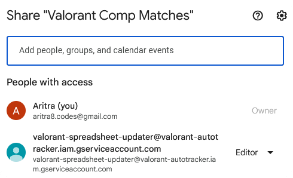
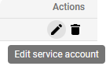
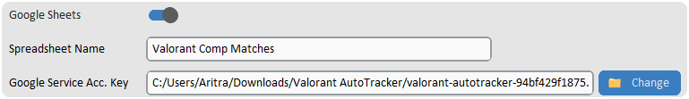

  
  <h1>Valorant AutoTracker</h1>

`Valorant AutoTracker` uploads all your Valorant matches to YouTube and puts them on a spreadsheet in the click of a button! 🔘👆

  

---

# This project is not affiliated with Riot Games. Go to the bottom for more information.

# ⬇️ Installation & Setup

Currently, only [Windows](https://www.microsoft.com/en-gb/windows) is supported (as Valorant does not support other OSes).

## Installation

**You will most likely need to make an exception in [Windows Security](https://support.microsoft.com/en-us/windows/add-an-exclusion-to-windows-security-811816c0-4dfd-af4a-47e4-c301afe13b26) and/or other antiviruses:**
- **Add an exception for .exe files.**
- **Follow the steps below (main installation).**
- **Add an exception for the folder with Valorant AutoTracker.**
- **Remove the exception for .exe files to avoid downloading harmful software in the future.**

 

Main Installation:
- Click on the latest release (on the right of the page, under the 'About' section).
- Download the 'Valorant AutoTracker.zip' file.
- Extract the file.
- You're ready to go!

## Setup (only the complicated parts)

- Auto-upload to YouTube:
  - Download [Firefox](https://www.mozilla.org/en-US/firefox/new).
  - Turn on the 'Auto-Upload Videos' setting.
     
    
  - Add a [new firefox profile](https://support.mozilla.org/en-US/kb/profile-manager-create-remove-switch-firefox-profiles) and copy the root directory path into the 'Firefox Profile Path' setting.
     
    
     
    
  - Save your settings.
     
    
  - Go to [YouTube Studio](https://studio.youtube.com) and log in.
  - Choose the YouTube channel to which you like to upload your matches (**if there is a 'Don't ask again' option, select it**).
- Insert to Google Sheets:
  - Go to [Google Cloud](https://console.cloud.google.com) and log in.
  - Create a [new project](https://console.cloud.google.com/projectcreate) and name it anything (e.g. Valorant AutoTracker)
  - Go to [APIs and services](https://console.cloud.google.com/apis), then to [Enabled APIs and services](https://console.cloud.google.com/apis/dashboard) and click the 'ENABLE APIS AND SERVICES' button.
     
    
  - Enable the [Google Drive API](https://console.cloud.google.com/apis/library/drive.googleapis.com) and [Google Sheets API](https://console.cloud.google.com/apis/library/sheets.googleapis.com).
  - Go back to [APIs and services](https://console.cloud.google.com/apis), then to [Credentials](https://console.cloud.google.com/apis/credentials), click the 'CREATE CREDENTIALS' button and choose the 'Service account' option.
     
    
  - Enter any Service account name (e.g. Valorant Spreadsheet Updater) and click the 'DONE' button.
  - Copy the service account's email, go to your Google Sheets spreadsheet and share it with this email as Editor.
     
    
     
    
  - Go back to the service account and click the 'Edit service account' button.
     
    
  - Go the 'KEYS' section, click 'ADD KEY', choose 'Create new key', choose JSON as the key type and click the 'CREATE' button. A .json file will be downloaded, save this to a memorable location (e.g. the Valorant AutoTracker folder).
  - Turn on the 'Google Sheets' setting, type in your spreadsheet's name in the 'Spreadsheet Name' setting and choose the location of the .json file you downloaded in the 'Google Service Acc. Key' setting.
     
    

---

# 💪 Team

 | 
---|---
[Aritra (aritra-codes)](https://github.com/aritra-codes) | [Lewis M (lmdrums)](https://github.com/lmdrums)
Backend | Frontend

---

# ❤️ Credits

- Big thanks to [Henrik-3](https://github.com/Henrik-3) and his [unofficial-valorant-api](https://github.com/Henrik-3/unofficial-valorant-api) for making this project possible.
- Massive thanks to [Tom Schimansky](https://github.com/TomSchimansky) with [CustomTkinter](https://github.com/TomSchimansky/CustomTkinter) for making the UI possible.

---

# Message for Riot Games

This application does not modify Valorant in any way. 
It only makes a request to the [unofficial-valorant-api](https://github.com/Henrik-3/unofficial-valorant-api) to get user and match data.
If you have any problems with this project, please send me an email at aritra8.codes@gmail.com.
