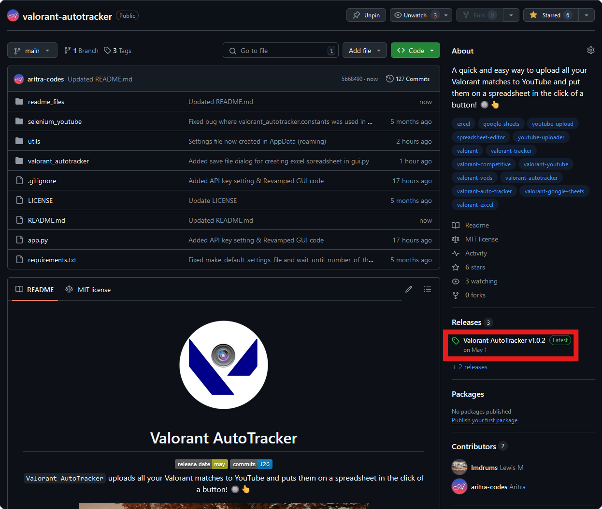
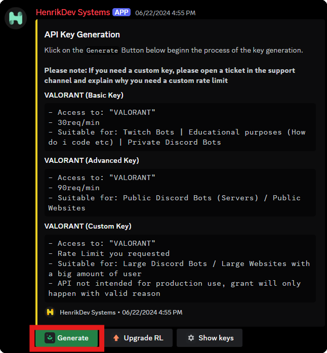
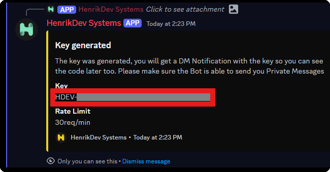

  

  # Valorant AutoTracker

  
  

  `Valorant AutoTracker` uploads all your Valorant matches to YouTube and puts them on a spreadsheet in the click of a button! 🔘👆

  

  If this helps you, please ⭐ the repository & [follow me](https://github.com/aritra-codes) :D

---

# ⬇️ Installation

Currently, only [Windows](https://www.microsoft.com/en-gb/windows) is supported (as Valorant does not support other OSes).

**Video Tutorial (old version, so some steps are invalid):**
 

Main Installation:
- Click on the latest [release](https://github.com/aritra-codes/valorant-aut/releases) (on the right of the page, under the 'About' section).
   
  
- Download 'Valorant_AutoTracker.msi'.
- Run the file (if there is a Windows Defender prompt, click 'More info' and 'Run anyway').
- Finish the installation wizard.
- Fill in the settings (check out the setup instructions below).
- You're ready to go!

---

# 🔄 Updating

Just follow the installation instructions above but you don't have fill in the settings again.

---

# ⚙️ Setup (only the complicated parts)
- API key:
  - Join the HenrikDev discord server (https://discord.gg/henrikdev-systems-704231681309278228).
  - Follow the instructions and verify yourself.
  - Go to the 'get-a-key' channel.
  - Click 'Generate' at the bottom of the message.
     
    
  - Select 'VALORANT'.
  - Select 'VALORANT (Basic Key)'.
  - In the Generate API Key form:
    - For Product Name, type 'Valorant AutoTracker'
    - For Product Description, type 'Uploads Valorant matches to YouTube and puts them on a spreadsheet.'
    - Click Submit.
  - Copy the key into the 'API Key' setting.
     
    
     
    
  - Click 'Save API Key'.
- Auto-upload to YouTube:
  - Download [Firefox](https://www.mozilla.org/en-US/firefox/new).
  - Turn on the 'Auto-Upload Videos' setting.
     
    
  - Go to the URL 'about:profiles' and create a [new firefox profile](https://support.mozilla.org/en-US/kb/profile-manager-create-remove-switch-firefox-profiles).
  - Copy the root directory path of that profile into the 'Firefox Profile Path' setting.
     
    
     
    
  - Click 'Save All' at the top of the settings window.
  - Go back to Firefox and click 'Launch profile in new browser'.
  - Go to [YouTube Studio](https://studio.youtube.com) and log in.
  - Choose the YouTube channel to which you like to upload your matches (**if there is a 'Don't ask again' option, select it**).
- Insert to Google Sheets:
  - Go to [Google Cloud](https://console.cloud.google.com) and log in.
  - Create a [new project](https://console.cloud.google.com/projectcreate) and name it anything (e.g. Valorant AutoTracker).
  - Go to [APIs and services](https://console.cloud.google.com/apis), then to [Enabled APIs and services](https://console.cloud.google.com/apis/dashboard) and click the 'ENABLE APIS AND SERVICES' button.
     
    
  - Enable the [Google Drive API](https://console.cloud.google.com/apis/library/drive.googleapis.com) and [Google Sheets API](https://console.cloud.google.com/apis/library/sheets.googleapis.com).
  - Go back to [APIs and services](https://console.cloud.google.com/apis), then to [Credentials](https://console.cloud.google.com/apis/credentials), click the 'CREATE CREDENTIALS' button and choose the 'Service account' option.
     
    
  - Enter any Service account name (e.g. Valorant Spreadsheet Updater) and click the 'DONE' button.
  - Copy the service account's email, go to your Google Sheets spreadsheet and share it with this email as Editor.
     
    
     
    
  - Go back to the service account and click the 'Edit service account' button.
     
    
  - Go the 'KEYS' section, click 'ADD KEY', choose 'Create new key', choose JSON as the key type and click the 'CREATE' button. A .json file will be downloaded, save this to a location you prefer.
  - Turn on the 'Google Sheets' setting, type in your spreadsheet's name in the 'Spreadsheet Name' setting and choose the location of the .json file you downloaded in the 'Google Service Acc. Key' setting.
     
    
  - Click 'Save All' at the top of the settings window.

---

# 💪 Team

 | 
---|---
[Aritra (aritra-codes)](https://github.com/aritra-codes) | [Lewis M (lmdrums)](https://github.com/lmdrums)
Backend | Frontend

---

# ❤️ Credits

- Big thanks to [Henrik-3](https://github.com/Henrik-3) and his [unofficial-valorant-api](https://github.com/Henrik-3/unofficial-valorant-api) for making this project possible.
- Massive thanks to [Tom Schimansky](https://github.com/TomSchimansky) with [CustomTkinter](https://github.com/TomSchimansky/CustomTkinter) for making the UI possible.

---

# ‼️ Disclaimer

This project is not associated with Riot Games. This application does not modify Valorant in any way, it only makes a request to the [unofficial-valorant-api](https://github.com/Henrik-3/unofficial-valorant-api) to get user and match data.

If you have any problems with this project, please send me an email at aritra8.codes@gmail.com.
